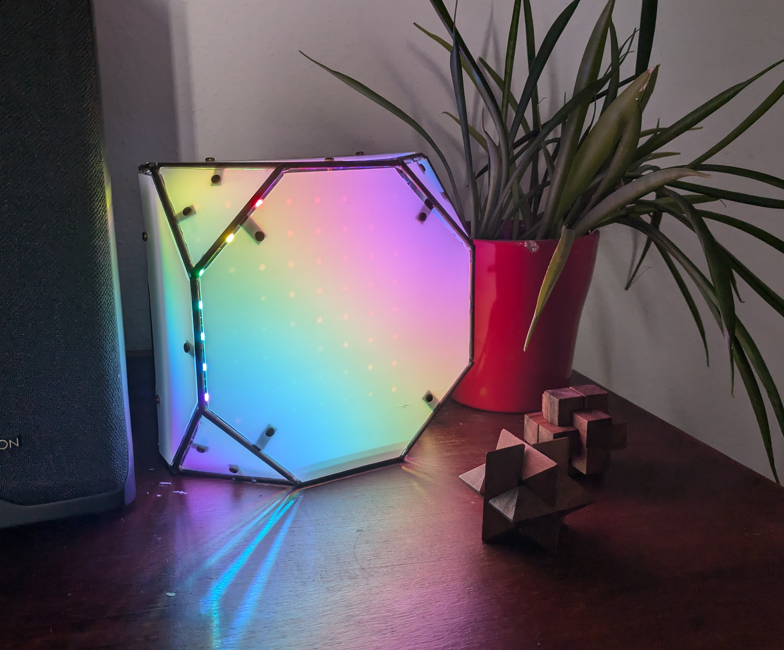
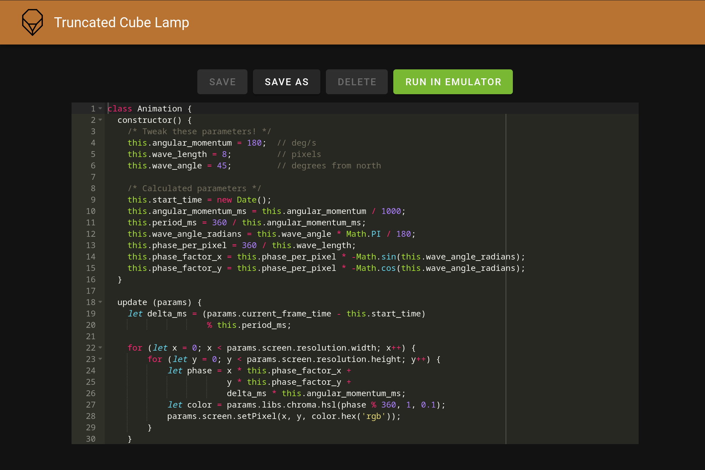

# truncated-cube-lamp

Truncated Cube Lamp: artsy remote code execution 👌

This lamp runs javascript animations, submittable via a embedded webserver:

View a [demo video](https://youtu.be/iKpsz_uIMqY) on youtube.



Script editing via web interface:



The most basic script looks like:

```javascript
class Animation {
  update (ctx) {
      for (let x = 0; x < ctx.screen.resolution.width; x++) {
        for (let y = 0; y < ctx.screen.resolution.height; y++) {
          ctx.screen.setPixel(x, y, 'black');
        }
      }
      ctx.screen.draw();

      return undefined;
  }
}
```

## Dependencies:

The API backend in written in Qt, because it has a nice and easy to use Javascript engine 🤷.

To run this on your desktop for testing, get Qt5 devel:

- Fedora 35 `qt5-qtbase-devel qt5-qtbase-private-devel qt5-qtdeclarative-devel`
- Ubuntu 21.04 `qtbase5-dev qtbase5-private-dev qtdeclarative5-dev`

Get, make, and install [QtHttpServer](https://code.qt.io/cgit/qt-extensions/qthttpserver.git/)
branch 5.15.

Then you use cmake to build the service.

The website requires node.js, look in the website directory for more details.

### Git Metarepo

Some dependencies are installed as git repository by [metarepo](https://github.com/blejdfist/git-metarepo).
Once installed, run:

```bash
git meta sync
```
